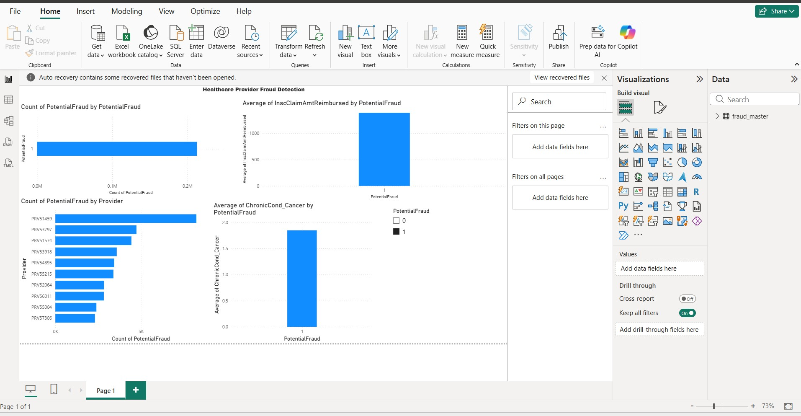

# healthcare-fraud-detection
Healthcare provider fraud detection using Python, Machine Learning and Power BI — 558K claims analyzed
# Healthcare Provider Fraud Detection

## Problem Statement
Healthcare fraud costs the US billions annually. This project identifies fraudulent 
healthcare providers using Medicare claims data with machine learning.

## Dataset
- Source: Kaggle — Healthcare Provider Fraud Detection
- Size: 558,211 claims, 50 columns
- Files: Train, Beneficiary, Inpatient, Outpatient data

## Approach
1. Merged 4 datasets into one master dataset
2. Exploratory Data Analysis (EDA)
3. Statistical outlier detection using Z-score
4. Random Forest Classification model
5. Power BI Dashboard for visualization

## Key Findings
- 38% of claims are from fraudulent providers (only 9% of total providers)
- High value claims (Z-score > 3) show 59% fraud rate vs 38% overall
- Fraudulent providers show higher Cancer diagnosis rates (upcoding)
- Top repeated claim amounts: $100, $10, $200 — suspicious round numbers

## Model Performance
- Algorithm: Random Forest (100 estimators)
- Accuracy: 71%
- Recall (Fraud): 60%

## Tools Used
- Python (Pandas, Scikit-learn, Seaborn, Matplotlib)
- Power BI Desktop
- Kaggle Notebooks

## Dashboard Preview

